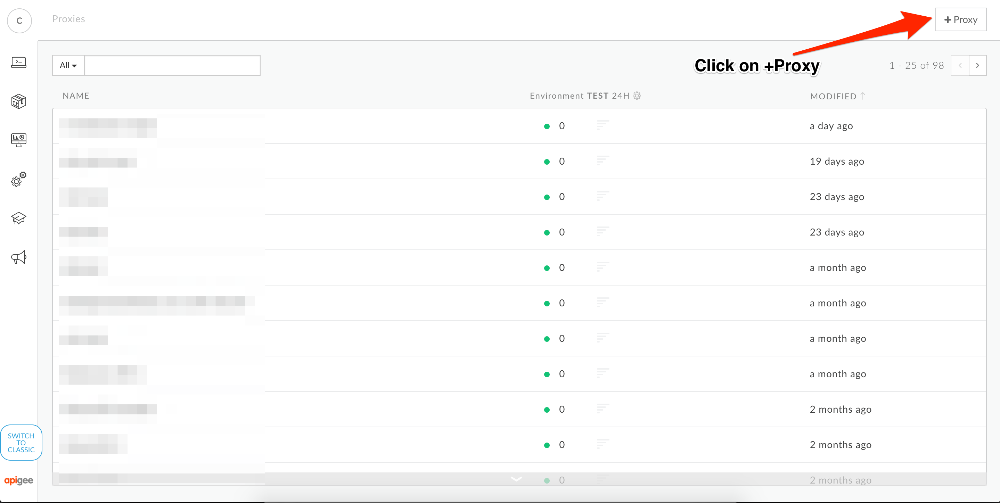

# API Development : Using Routing Rules for Multiple Backends

*Duration : 30 mins*

*Persona : API Team*

# Use case

It's common for large companies to have multiple backend systems that provide duplicate functionality for certain sets of data. A common example is a company that, usually through mergers and acquisitions, has multiple customer, contract, or ordering systems. From an API perspective, it's desirable to mask the routing comlexity from the end API consumer to make it appear as though the organization has single unified API for a given business function or data type. Therefore, it's helpful to have a way to conditionally route a request to a paticular backend based on information in the request.

# How can Apigee Edge help?

Apigee Edge provides a construct known as a *Routing Rule* which allows API developers to include conditional logic and multiple backend target endpoint definitions for a single API Proxy. In this lab, we will examine the steps required to implement Routing Rules inside of Apigee Edge.

# Context

In this lab, we'll build a branch finder for a fictional banking company. We will be working with two APIs that both return branch locations based on zip code. The first API returns exclusively bank branches located in Canada. The other returns branches in the US. 

The Canadian API is located here: `https://findemo-168618.appspot.com/can/branches`

The US API is located here: `https://findemo-168618.appspot.com/us/branches`

Instead of making the API consumers keep track of which API to use, we'll create a single API and route between the two backends. Canadian zip codes and US zip codes can be differentiated by evaluating their structure and seeing if it matches a regex pattern. US zip codes will be identified by five numeric digits while Canadian zip codes will match the pattern of letter, number, letter, space, number, letter, number. For example, a US zip code will be something like "43210" and a Canadian zip code will be something like "A1A 1A1".

When a request comes into our API proxy, we will first make sure that a zip code has been supplied. If it matches the pattern of a US zip code, we will route it to the US backend. If it matches the pattern of a Canadian zip code, we will route it to the Canadian backend. If it matches neither, we'll skip the request and return an empty JSON array.

# Pre-requisites

None

# Instructions

* Go to [https://apigee.com/edge](https://apigee.com/edge) and log in. This is the Edge management UI. 

* Open the Develop Menu from the left hand side navigation bar then click on the API Proxies menu item.


* Click on the +Proxy button in the upper right corner of the API proxy list panel



* In the new proxy creation wizard, select the Reverse Proxy option and then click on Next


* Enter values for Proxy Name, Proxy Base Path and Existing API. Click Next.


```
Proxy Name: {your initials}-branches
Proxy Base Path: /{your initials}-branches
Existing API: https://findemo-168618.appspot.com/can/branches
```

* Select the pass through option for Authorization then click Next.


* Accept all the default values for the Virtual Host configuration then click Next.


* Accept all the default values for the final configuration confirmation, then click Next.


* When the confirmation displays, click on the proxy name link to open a detailed view of your API proxy.


# Lab Video

# Earn Extra Points

# Quiz

# Summary

# References
